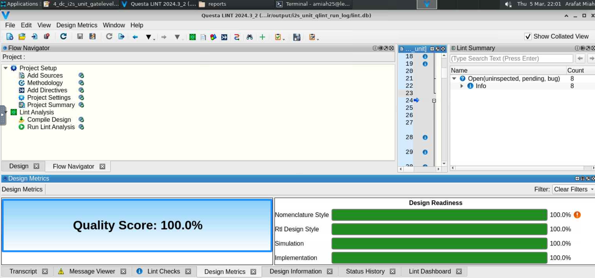
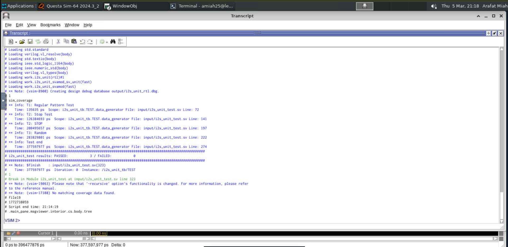
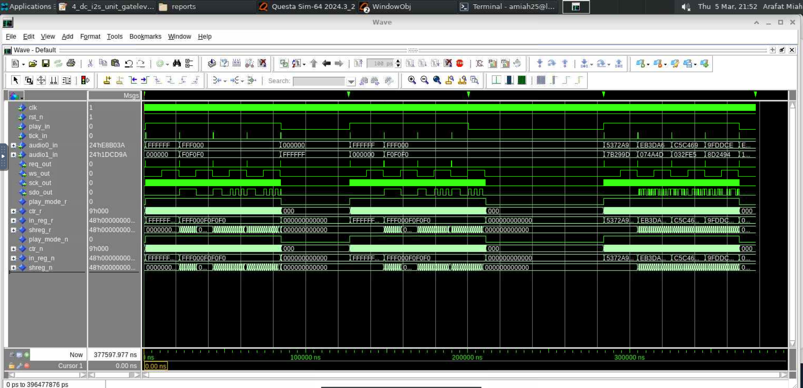

# RTL I²S Unit Design, Verification, and Synthesis (Lab 08)

## Repository
**Recommended name:** `Digital-Technique-3_Lab-08-RTL-I2S-Verification`

## Overview
This repository contains the finalized RTL implementation, formal verification, and gate-level synthesis of an **I²S (Inter-IC Sound) transmitter unit** developed for **Digital Technique 3 – Lab 08**. 

Building upon the initial architecture, the design was highly optimized to meet strict I²S protocol timing requirements (specifically the 1-bit delay for the Word Select signal) and synthesized into physical logic gates using Synopsys Design Compiler.

## Files Included
- `i2s_unit.vhd` — The final, synthesizable RTL implementation of the I²S unit.
- `i2s_unit_svamod.sv` — SystemVerilog Assertions (SVA) defining Blackbox and Whitebox rules for formal/dynamic verification.
- `i2s_unit.sdc` — Synopsys Design Constraints file defining the 54.2ns clock period and 6.775ns I/O delays.
- `fig_8_1_lint_summary.png` — Evidence of clean static code analysis (0 Errors, 0 Warnings).
- `fig_8_2_simulation_transcript_passed.png` — Evidence of successful dynamic simulation (PASSED: 3 / FAILED: 0).
- `fig_8_3_simulation_waveform.png` — Simulation waveform showing perfectly aligned SCK, WS, and SDO data transmission.

---

## 8.1 Refined RTL Architecture Specification
The architecture was refined using a strict "Two-Process" VHDL methodology (separating combinational next-state logic from sequential register updates). This completely eliminated the risk of unintended latches during synthesis.

### Core Datapath & Control
- **`play_mode_r` (1-bit Register):** Tracks the operating state and ensures graceful stops by waiting for the current frame to finish.
- **`ctr_r` (9-bit Counter):** A single master time base (0 to 383) that drives all clock generation (`sck_out`, `ws_out`) and data shift/load events.
- **`in_reg_r` (48-bit Register):** Captures incoming stereo audio channels on `tick_in`.
- **`shreg_r` (48-bit Shift Register):** Serializes the data to `sdo_out` exactly on the falling edge of `sck_out`.
- **Total Hardware Footprint:** Exactly 106 Sequential Flip-Flop Bits.

**Figure 8.1 — Questa Lint Clean Analysis** 

---

## 8.2 Verification & Synthesis Results

### Dynamic Simulation & Formal Verification
The design was subjected to strict SystemVerilog Assertions (SVA) via Questa Formal and dynamic testbenches. 
- **Functional Simulation:** Achieved a perfect pass rate (3/3 tests passed) handling directed patterns, graceful stops, and random data injection.
- **Formal Verification:** Successfully proved the RTL against 28 Assertions and 19 Cover properties, ensuring the pipeline never deadlocks and reset states are guaranteed.

**Figure 8.2 — Simulation Transcript (Passed)** 

**Figure 8.3 — I²S Waveform Timing** 

### Gate-Level Synthesis
The design was synthesized using **Synopsys Design Compiler** targeting a standard cell library.
- **Synthesizability:** 100% clean. No latches (`ELAB-974`) or combinational timing loops (`OPT-314`) were inferred.
- **Timing Met:** The design comfortably met the 54.2ns clock period requirement, achieving a generous worst-case Reg-to-Reg slack of **+53.36 ns**.

---

## 8.3 Observations and Learning
### What I observed
- **The I²S "1-Bit Delay" Protocol:** Aligning the Word Select (`ws_out`) signal exactly 8 clock cycles *before* the MSB data required highly precise counter boundaries (`188` and `380`). Even a 1-clock-cycle mismatch caused the receiver to lose synchronization.
- **Assertion Paradoxes:** Whitebox SVA properties must be written carefully. An overly strict rule asserting that a register "must hold its value" caused false failures when the state machine properly attempted to clear the register to zero during standby mode.
- **Synthesis Implications:** Initializing signals with default values at the top of a combinational VHDL process is the most effective way to guarantee the synthesis tool maps pure combinational logic instead of error-prone latches.

### What I learned
- How to bridge the gap between abstract HDL simulation and physical gate-level synthesis using `.sdc` timing constraints.
- Advanced debug techniques combining waveform analysis and assertion-driven counterexamples to isolate sub-cycle timing bugs.

---

## Notes
When I got stuck, I used AI as a guidance tool to clarify concepts and validate my approach; however, the RTL code and report content were written by me.

## Author
Arafat Miah
